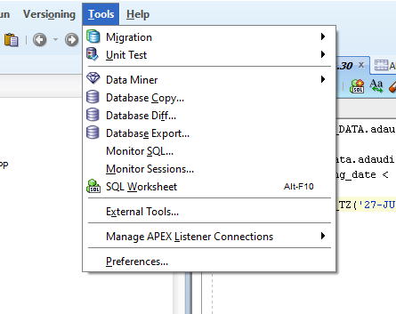
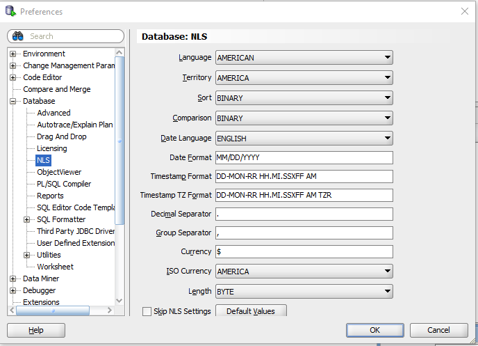
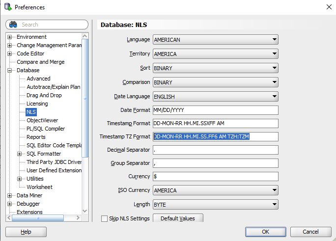
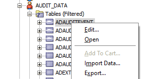
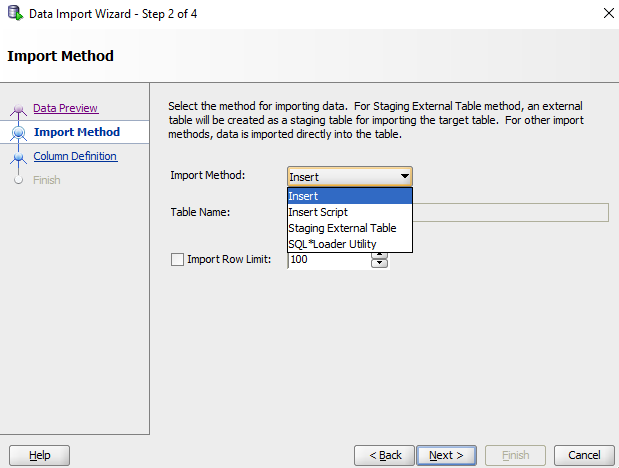

# QA data generator
QA data generator can be used to generate data in csv format given table columns and data_types.
Generated data can mimic actual Names and Adderesses, GUIDs. Currently this program specialized to generate AuditEvent JOSN clobs as well.
Below are the instructions. 

Note that this program <mark>does not</mark> create new audit event  objects/clobs.
 

## Installation

To run the above application, you'll need the following requirements on your machine:

1. **Python**: Ensure that you have Python installed on your machine. You can download the latest version of Python from the official Python website: https://www.python.org/downloads/

2. **pip**: Check if `pip` is installed by running the following command in your terminal:
   ```
   pip --version
   ```
   If `pip` is not installed, you can refer to the pip documentation for installation instructions: https://pip.pypa.io/en/stable/installing/

3. **Faker Library**: Install the `Faker` library, which is used for generating fake data. You can install it by running the following command:
   ```
   pip install Faker
   ```

Once you have fulfilled these requirements, you can save the `test_data_generator.py` and `main.py` files in the same directory. Then, navigate to that directory using the command prompt or terminal and run the `main.py` script with the command:
```
python main.py
```

The script will generate test data based on the provided column names, column types, number of rows, and output file name. The generated data will be saved in a CSV file specified by the output file name.

## Usage

To run the code, follow these steps:

1. Save the code in two separate files: `test_data_generator.py` and `main.py`. The code in `test_data_generator.py` should contain the function `generate_test_data()` and `select_random_json()`, while `main.py` should contain the main script.

2. Open a terminal or command prompt and navigate to the directory where the two files are saved.

3. Install the `Faker` library if you haven't already. Run the following command in the terminal:
   ```
   pip install Faker
   ```

4. Modify the code in `main.py` according to your requirements. Specify the desired column names, column types, number of rows, and the output file name.
   To generate data for audit_data.adauditevent_v2 table columns should be specified as follows:
   
   - column_names = ['ID', 'DATE_INSERTED', 'SESSIONID', 'AUDITEVENT', 'SPECIFICATION']
   - column_types = ['string', 'timestamp(6) with time zone', 'string', 'string', 'string']

   According to the column name and column type the values are determined (See `generate_test_data` function). Then update the `num_rows` and `num_files`.
   For each file the given `num_rows` will be generated. According to the `base_filename` and number of file the file name will be decided. 
   
   Eg: num_files = 2
       base_filename = 'test_data_Jan' 

       Then file names with 'test_data_Jan_1' and 'test_data_Jan_2' will be generated. 
       
   Note: It is recommended to create multiple files rather than generating 1 file with larger data set to eliminate performance issues when importing data.

   According to the `json_dir_name`, the audit event clob will be selected randomly from the given directory. 

   Eg: 
      - JSON_File_List_Extractable  - contains only extractable events
      - JSON_File_List_Non - contains only non-extractable events
      - JSON_File_List_Mix - contains both extractable and non-extractable events

   Make sure that relevant directories include relevant files.

   Date_inserted  column will be generated according to below arguments. 
   
      - start_date = datetime.datetime(2022,1,1,13,0,0)      
      - end_date = datetime.datetime(2022,1,31,15,0,0)

   However data will be generated for above, 
     -  events will be generated from 2022 Jan 1st to 31st. between 1pm to 3pm.
     -  If you want to generate data for same day 1 hour then,
               
               -- start_date = datetime.datetime(2022,1,1,13,0,0)
               -- end_date = datetime.datetime(2022,1,1,14,0,0)         
                     --> this will generate between 1pm and 2pm for 2022/01/01
     - For a month then 
               
               -- start_date = datetime.datetime(2022,1,1,0,0,0)
               -- end_date = datetime.datetime(2022,1,31,23,59,59)
    
    Change the timezone to respected time zone.
    
         --  time_zone = '+05:30'


5. Run the script by executing the following command in the terminal:
   ```
   python main.py
   ```

   This will execute the `main.py` script and generate the test data based on the provided inputs. The generated data will be saved in a CSV file with the specified output file name.

6. After running the script, you will see a message in the terminal indicating the number of rows of test data generated and the location of the output file.

Make sure you have Python installed on your machine and the required packages (`Faker`) installed before running the code.

7. To import the test data you can use Oracle Sql developer ([download here](https://www.oracle.com/database/sqldeveloper/technologies/download/))
   
   ### NLS - DateTime types
   
      Before importing the test data you need to changed the date time import types. Follow below steps:

      - Open `Tools` then `Preferences`
      
         

      - Expand `Database` and then select  `NLS`
      
         

      - Change `Timestamp TZ Format` to `DD-MON-RR HH.MI.SS.FF6 AM TZH:TZM`
      
         
   
   ### Importing
   - Create new database connection
   - Expand db connection

      

   - Expand `other users`
   - Right click on table and `import data`

      
   - Select file and import
   - When importing, import method can be either `insert` or `insert script`.

   

## Contributing

Pull requests are welcome. For major changes, please open an issue first
to discuss what you would like to change.

Please make sure to update tests as appropriate.

## Owner

Reshan.D

